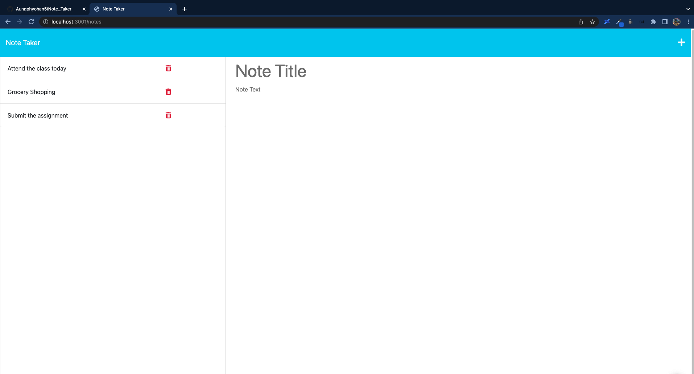

# Note_Taker

In this project, I developed an application that makes it simple for users to able to write and save notes.


## Table of Contents

- [Tasks Completed](#TaskCompleted)
- [Link](#Link)
- [Screenshot](#Screenshot)
- [Demo-Video](#Demo-Video)
- [Installation](#Installation)
- [Usage](#Usage)
- [License](#license)


## Tasks Completed

- Presented with landing page with a link to a note page

- New note will appear in the left-hand column when save the new note

- User can delete the note by clicking on the delete button

- When user click on the write icon, it will present the empty fields to write the new note. 


## Link


Repository URL  - https://github.com/Aungphyohan5/Note_Taker

Deployed URL -


## Screenshot




## Demo-Video

https://user-images.githubusercontent.com/112873819/214058188-9e718b24-0701-4adb-bb70-2acdb95dc6bc.mp4

## Installation


```bash
  npm i 
```
    

## Usage


```bash
  node server.js 
```


## License

[MIT](https://choosealicense.com/licenses/mit/)

